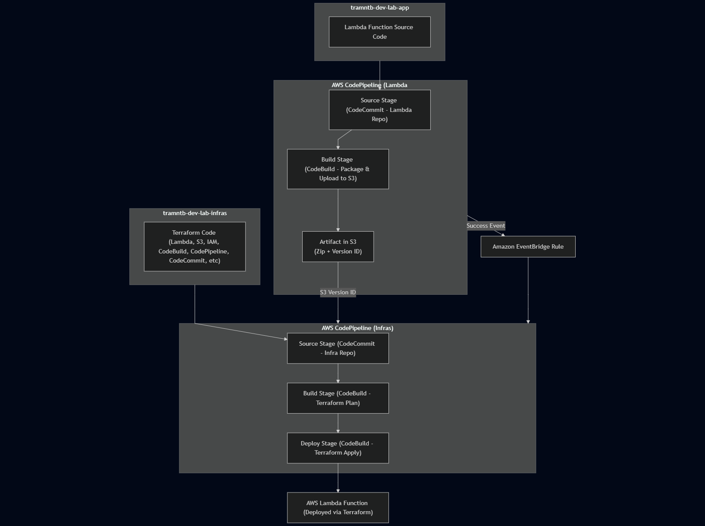

# CI/CD Pipeline for AWS Lambda
Serverless Lambda CI/CD with AWS CodePipeline, CodeBuild & Terraform

This project demonstrates a CI/CD pipeline for managing AWS Lambda functions with infrastructure and application code separated into two repositories.

- tramntb-dev-lab-infras-repo (infra-repo) → contains Terraform code for provisioning and updating AWS resources (Lambda, S3, IAM, etc.).
- tramntb-dev-lab-app-repo (lambda-repo) → contains the Lambda function source code

Benefits
- Separation of concerns → infra and app code managed independently.
- Automated deployments → commits trigger pipelines, no manual steps.
- Safe workflows → Terraform Plan + optional Manual Approval before apply.
- Versioned artifacts → Lambda packages stored in S3 for rollback.
- Event-driven orchestration → Lambda updates automatically applied by infra pipeline.

